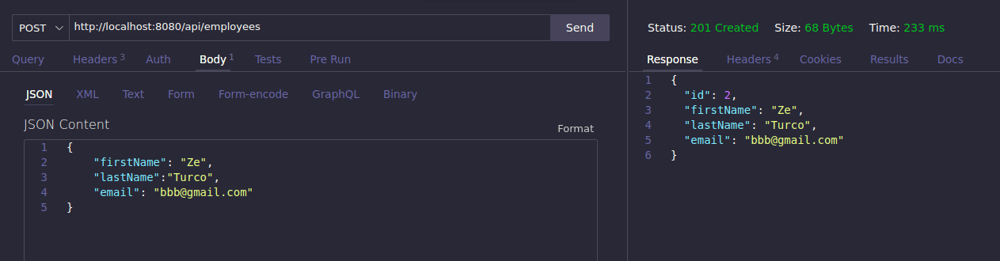
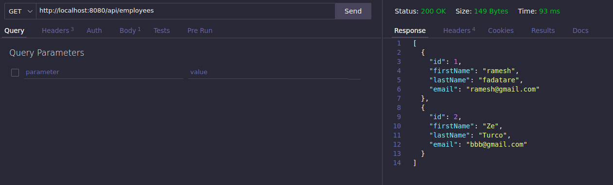
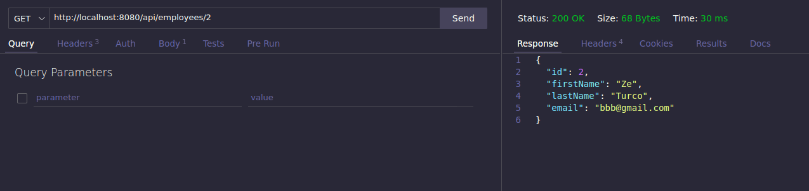
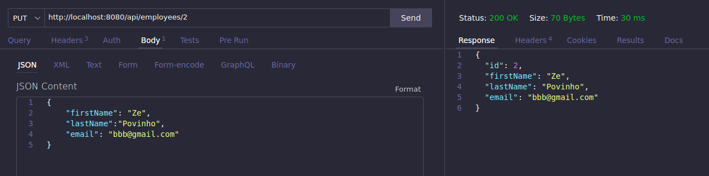
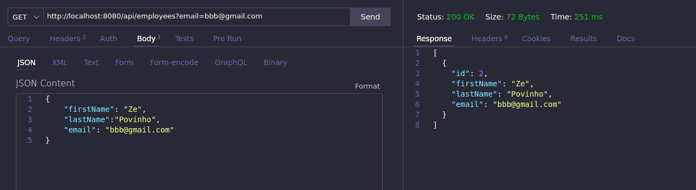

# Important

Every program was tested using VSCode (using F5 key to run) from `Lab3` folder.

Exception for Lab3_3, which was tested using `docker compose up` on `lab3_3` folder.

# Notes

## Lab3_1

### Alinea c)

#### Instantiating the UserRepository:

The "UserController" class gets an instance of the "userRepository" through dependency injection.
The UserRepository instance is instantiated and managed by Spring Framework's IoC (Inversion of Control) container.
The instantiation of the UserRepository is handled by Spring Boot, which automatically creates a bean for it.
#### Methods Invoked on UserRepository:

The "UserController" class invokes several methods on the "userRepository" object. These methods are provided by the CrudRepository interface, which is extended by the "UserRepository" interface.

The main methods used by "UserController" include:

userRepository.save(user): This method is used to save a new user or update an existing user.
userRepository.findAll(): This method retrieves a list of all users.
userRepository.findById(id): This method retrieves a user by their ID.
userRepository.delete(user): This method deletes a user from the repository.
These methods are defined in the "CrudRepository" interface, which is part of Spring Data JPA. Spring Data JPA provides standard repository interfaces with common data access methods.

#### Where Data Is Being Saved:

The data is being saved in a database. Specifically, it is being persisted in a relational database using JPA (Java Persistence API) provided by Spring Data JPA.
The exact database and connection details are typically specified in the application's configuration properties or application.properties file, which is not provided in the code snippet. Common database choices include H2, MySQL, PostgreSQL, or others.
#### "Not Empty" Email Address Validation Rule:

The validation rule for ensuring that the email address is not empty is defined in the "MyUser" entity class using the @NotBlank annotation.
This annotation is part of the Bean Validation API (commonly known as JSR 380), and it indicates that the annotated field must not be empty.
The error message associated with the @NotBlank annotation is defined in the message attribute of the annotation. If the "email" field is empty, the error message defined in the annotation will be displayed.

## Lab3_2

### Images

